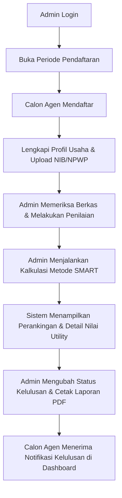

# 📖 Panduan Lengkap Instalasi & Cara Menjalankan Program
## Sistem Pendukung Keputusan (SPK) Seleksi Calon Agen - Metode SMART

Panduan ini berisi instruksi terperinci mulai dari persiapan sistem (requirements), konfigurasi, ekstraksi & import database dari file `spk-smart-agen.sql.gz`, hingga langkah-langkah menjalankan aplikasi di lingkungan lokal.

---

## 📌 Ringkasan Cepat (Quick Start)

Jika environment Anda sudah siap (PHP 8.3+, Composer, Node.js, MySQL di Laragon/XAMPP):

```bash
# 1. Masuk ke direktori project
cd C:\laragon\www\SPKSmartAgen

# 2. Buat database MySQL dengan nama 'spksmartagen' di phpMyAdmin atau HeidiSQL

# 3. Ekstrak & import database dari file 'database/spk-smart-agen.sql.gz':
# - Opsi CLI: Ekstrak file .gz menggunakan PHP lalu import ke MySQL:
php -r "file_put_contents('database/spk-smart-agen.sql', gzdecode(file_get_contents('database/spk-smart-agen.sql.gz')));"
mysql -u root spksmartagen < database/spk-smart-agen.sql
# (Atau langsung upload 'database/spk-smart-agen.sql.gz' di tab Import phpMyAdmin)

# 4. Salin .env dan generate key (jika belum ada)
copy .env.example .env
php artisan key:generate

# 5. Install dependensi PHP & Frontend
composer install
npm.cmd install

# 6. Hubungkan direktori upload berkas
php artisan storage:link

# 7. Jalankan aplikasi
# Terminal 1:
php artisan serve
# Terminal 2:
npm.cmd run dev
```
Akses di browser: 👉 **http://127.0.0.1:8000**  
Login Admin: **`admin@smart.com`** | Password: **`password`**

---

## 1. ⚙️ Kebutuhan Sistem (System Requirements)

Pastikan spesifikasi dan perangkat lunak berikut telah terpasang pada komputer Anda:

### A. Perangkat Lunak Utama
1. **PHP**: Versi **`8.3.0` atau lebih baru**.
   - Cek versi dengan: `php -v`
2. **Composer**: Versi **`2.x`**.
   - Cek versi dengan: `composer -V`
3. **Node.js & npm**: Node.js **`>= 18.x`** (disarankan v20 atau v22) dan npm **`>= 9.x`**.
   - Cek versi dengan: `node -v` dan `npm.cmd -v`
4. **Database Server**: **MySQL 5.7+ / 8.0+** atau **MariaDB 10.4+**.
5. **Web Server Stack (Disarankan)**: **Laragon** (atau **XAMPP**) untuk sistem operasi Windows.

### B. Ekstensi PHP yang Wajib Aktif
Buka file konfigurasi `php.ini` (pada Laragon: *Menu > PHP > php.ini*) dan pastikan ekstensi berikut tidak diawali tanda titik koma `;` (sudah aktif):
- `pdo_mysql`
- `mbstring`
- `openssl`
- `fileinfo`
- `curl`
- `gd`
- `xml`
- `ctype`
- `tokenizer`

---

## 2. 🗄️ Persiapan & Import Database dari File `sql.gz`

Database aplikasi ini telah disediakan dalam bentuk file dump terkompresi di dalam folder `database/`:
📁 **`database/spk-smart-agen.sql.gz`**

### Langkah A: Buat Database Baru
1. Buka aplikasi **Laragon** atau **XAMPP**, lalu klik tombol **Start All** (pastikan servis MySQL berstatus *Running*).
2. Buka pengelola database (pilih salah satu):
   - **phpMyAdmin**: [http://localhost/phpmyadmin](http://localhost/phpmyadmin), ATAU
   - **HeidiSQL** (bawaan Laragon).
3. Buat database baru dengan nama:
   ```sql
   spksmartagen
   ```
   *(Pilih Collation: `utf8mb4_unicode_ci`)*

---

### Langkah B: Ekstrak & Import File `spk-smart-agen.sql.gz`

Pilih **salah satu** dari 3 cara praktis berikut:

#### 🔹 Cara 1: Import Langsung via phpMyAdmin (Paling Praktis Tanpa Perlu Ekstrak Manual)
phpMyAdmin secara bawaan mendukung file `.sql.gz` tanpa perlu diekstrak terlebih dahulu.
1. Buka **phpMyAdmin** (`http://localhost/phpmyadmin`).
2. Klik nama database **`spksmartagen`** di bilah navigasi sebelah kiri.
3. Klik tab **Import** pada menu bagian atas.
4. Pada bagian **File to import**, klik tombol **Choose File** (Pilih Berkas).
5. Arahkan dan pilih file:
   ```
   C:\laragon\www\SPKSmartAgen\database\spk-smart-agen.sql.gz
   ```
6. Gulir ke bawah dan klik tombol **Import** (atau **Kirim / Go**).
7. Tunggu beberapa saat hingga muncul notifikasi sukses (*Import has been successfully finished*).

---

#### 🔹 Cara 2: Ekstrak via Terminal (CLI) lalu Import ke MySQL
Jika Anda lebih suka menggunakan baris perintah di terminal (PowerShell / Command Prompt):

1. **Ekstrak file `.sql.gz` menjadi file `.sql` menggunakan PHP:**
   Jalankan perintah ini di direktori project:
   ```powershell
   php -r "file_put_contents('database/spk-smart-agen.sql', gzdecode(file_get_contents('database/spk-smart-agen.sql.gz')));"
   ```
   *Perintah di atas akan mengekstrak file `spk-smart-agen.sql.gz` menjadi file `database/spk-smart-agen.sql`.*

2. **Import file SQL hasil ekstrak ke database MySQL:**
   - **Jika MySQL tanpa password (default Laragon / XAMPP):**
     ```powershell
     mysql -u root spksmartagen < database/spk-smart-agen.sql
     ```
   - **Jika MySQL menggunakan password:**
     ```powershell
     mysql -u root -p spksmartagen < database/spk-smart-agen.sql
     ```
     *(Masukkan password MySQL Anda saat diminta).*

---

#### 🔹 Cara 3: Ekstrak Menggunakan Aplikasi Arsip (7-Zip / WinRAR)
1. Buka folder `database\` pada File Explorer Windows.
2. Klik kanan pada file **`spk-smart-agen.sql.gz`**.
3. Pilih **7-Zip** atau **WinRAR** > klik **Extract Here** (Ekstrak di sini).
4. Anda akan mendapatkan file baru bernama **`spk-smart-agen.sql`**.
5. Buka **HeidiSQL** atau **phpMyAdmin**, buka tab Query/SQL, lalu buka dan jalankan file `spk-smart-agen.sql` tersebut ke database `spksmartagen`.

> **Catatan Penting:**  
> Karena database telah diisi lengkap dari file dump `spk-smart-agen.sql.gz`, Anda **TIDAK PERLU** menjalankan perintah `php artisan migrate --seed` lagi. Seluruh tabel, akun admin default, kriteria, dan data master sudah otomatis tersedia.

---

## 3. 📝 Konfigurasi Environment (`.env`)

1. Pada folder utama project `c:\laragon\www\SPKSmartAgen`, cek apakah file `.env` sudah ada.
2. Jika belum ada, buat salinan dari file `.env.example`:
   ```powershell
   copy .env.example .env
   ```
3. Buka file `.env` dan periksa bagian konfigurasi database berikut:
   ```env
   APP_NAME="SPK SMART Agen"
   APP_ENV=local
   APP_KEY=
   APP_DEBUG=true
   APP_URL=http://localhost:8000

   DB_CONNECTION=mysql
   DB_HOST=127.0.0.1
   DB_PORT=3306
   DB_DATABASE=spksmartagen
   DB_USERNAME=root
   DB_PASSWORD=
   ```
   > **Catatan:**
   > - Jika menggunakan Laragon / XAMPP standar, `DB_USERNAME` adalah `root` dan `DB_PASSWORD` dikosongkan.
   > - Jika MySQL Anda menggunakan password khusus, isi di variabel `DB_PASSWORD`.

---

## 4. 📦 Instalasi Dependensi (Backend & Frontend)

Buka terminal (PowerShell, Command Prompt, atau Terminal di VS Code) di folder project:

### A. Dependensi Backend (PHP / Laravel)
```bash
composer install
```
*Perintah ini akan mengunduh seluruh dependensi framework Laravel dan library seperti `barryvdh/laravel-dompdf`.*

### B. Generate Kunci Enkripsi Aplikasi
```bash
php artisan key:generate
```
*Perintah ini akan mengisi nilai `APP_KEY` di file `.env`.*

### C. Dependensi Frontend (Node.js / Tailwind CSS / Vite)
```bash
npm.cmd install
```
*(Catatan Windows: Gunakan `npm.cmd install` jika PowerShell menampilkan error pembatasan script execution).*

---

## 5. 📁 Pembuatan Symlink Storage Berkas

Aplikasi memiliki fitur upload dokumen pendaftaran calon agen (NIB & NPWP). Agar berkas yang diunggah ke folder privat `storage/app/public` dapat diakses dari browser, jalankan:

```bash
php artisan storage:link
```

---

## 6. 🚀 Menjalankan Aplikasi

Terdapat beberapa cara untuk menjalankan server aplikasi:

### Cara 1: Menjalankan Dua Terminal (Sangat Disarankan untuk Development)

Buka 2 jendela terminal di folder project:

- **Terminal 1 (Server Laravel):**
  ```bash
  php artisan serve
  ```
  Output menandakan server aktif di: `http://127.0.0.1:8000`

- **Terminal 2 (Compiler Vite):**
  ```bash
  npm.cmd run dev
  ```
  Vite akan mengompilasi file CSS & JavaScript secara real-time.

Buka browser Anda dan akses:
👉 **[http://127.0.0.1:8000](http://127.0.0.1:8000)**

---

### Cara 2: Menjalankan Perintah Sekaligus (Concurrently)

Jika Anda ingin menjalankan server backend dan compiler Vite dalam satu perintah saja:
```bash
composer run dev
```

---

### Cara 3: Menjalankan via Virtual Host Laragon

Jika Anda memakai Laragon:
1. Jalankan build produksi asset sekali saja:
   ```bash
   npm.cmd run build
   ```
2. Klik **Start All** di Laragon.
3. Buka browser dan akses domain otomatis Laragon:
   👉 **`http://spksmartagen.test`**

---

## 👥 Informasi Akun & Hak Akses Pengguna

Akun bawaan yang sudah ada di dalam database hasil import:

| Role | Akun Email | Password | Keterangan |
| :--- | :--- | :--- | :--- |
| **Administrator** | `admin@smart.com` | `password` | Mengelola periode, kriteria, verifikasi agen, input nilai, kalkulasi SMART, cetak laporan. |
| **Calon Agen** | Mandiri melalui Register | Dibuat saat daftar | Calon agen mendaftar di menu **Register** (`/register`), melengkapi form, dan mengunggah dokumen. |

---

## 🔄 Alur Penggunaan Aplikasi (Workflow)



1. **Admin membuka periode pendaftaran** di menu *Periode Pendaftaran*.
2. **Calon agen melakukan registrasi akun** dan mengisi formulir screening serta mengunggah berkas NIB dan NPWP.
3. **Admin masuk ke menu Penilaian**, memilih periode yang aktif, dan memberikan nilai pada masing-masing kriteria.
4. **Admin masuk ke menu Metode SMART**, klik tombol **Hitung SMART** untuk memproses normalisasi bobot, nilai utility, dan perankingan alternatif secara otomatis.
5. **Admin dapat mencetak laporan rekap** dalam format PDF.
6. **Calon agen melihat notifikasi status kelulusan** pada dashboard masing-masing.

---

## 🛠️ Panduan Mengatasi Kendala (Troubleshooting)

### 1. Error `npm.ps1 cannot be loaded because running scripts is disabled`
- **Sebab**: Kebijakan eksekusi script PowerShell Windows membatasi script `.ps1`.
- **Solusi**:
  Gunakan perintah dengan ekstensi `.cmd`:
  ```powershell
  npm.cmd install
  npm.cmd run dev
  ```
  Atau ubah execution policy PowerShell (buka PowerShell Run as Administrator):
  ```powershell
  Set-ExecutionPolicy -Scope CurrentUser RemoteSigned
  ```

### 2. File Dokumen NIB / NPWP Tidak Bisa Dibuka (404 Not Found)
- **Solusi**: Jalankan perintah pembuat symlink storage:
  ```bash
  php artisan storage:link
  ```

### 3. Error Koneksi Database: `SQLSTATE[HY000] [1045] Access denied`
- **Solusi**: Pastikan servis MySQL di Laragon / XAMPP sudah dinyalakan, periksa `DB_USERNAME` dan `DB_PASSWORD` pada file `.env`.

### 4. Tampilan Web Hancur / Styling Tailwind Tidak Muncul
- **Solusi**: Pastikan `npm.cmd run dev` sedang berjalan di terminal, atau jalankan `npm.cmd run build` untuk mengompilasi styling.

### 5. Membersihkan Cache Aplikasi
Jika ada perubahan konfigurasi atau rute yang tidak terbaca:
```bash
php artisan optimize:clear
```
